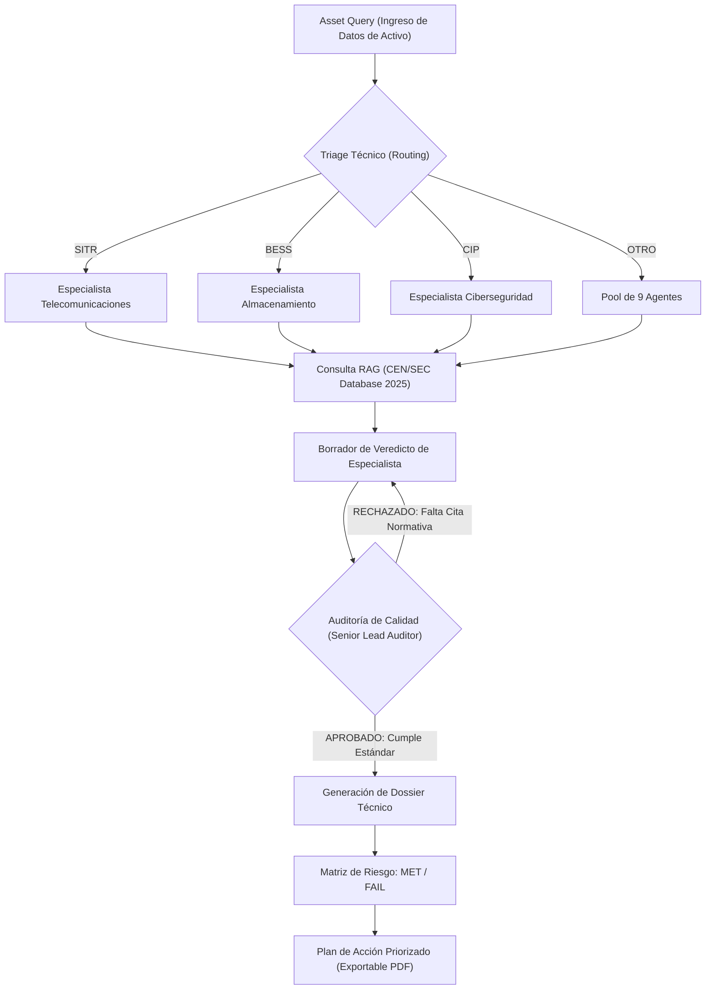

# Visualización del Ciclo de Vida de Auditoría Normativa

Como ingenieros, la trazabilidad del proceso es fundamental. A continuación, se presenta el flujo que sigue cada consulta en el **Intelligence Hub** para garantizar veredictos de alta fidelidad.

## 1. Ciclo de Auditoría (Asset Workflow)

